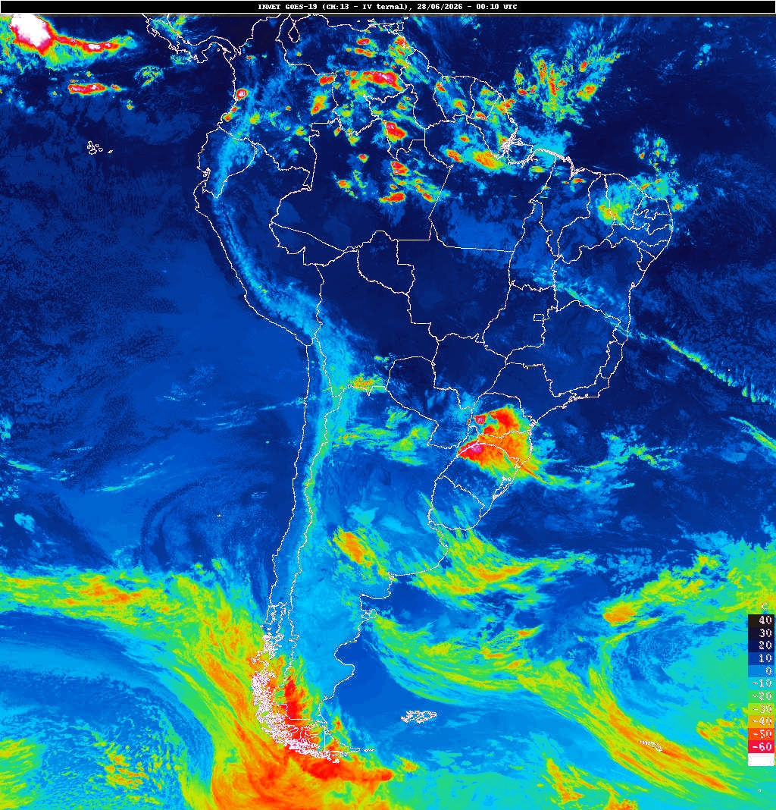

# Weather Vision

AI-powered meteorological image analysis with structured output schemas.

## Installation

Package manager: [uv](https://docs.astral.sh/uv/).

```bash
uv sync
cp .env.example .env
# edit .env and set OPENROUTER_API_KEY and MODEL_NAME
```

## Usage

```bash
uv run wv path/to/image.jpg
uv run wv path/to/image.jpg --pretty
```

Accepted formats: `.png`, `.jpg`, `.jpeg`.

## Example output

**Input image**



**Structured output (JSON)**

```json
{
  "map_type": "satellite",
  "region_covered": "South America",
  "events": [
    {
      "kind": "severe_storm",
      "severity": "high",
      "region": "Southern Brazil and Uruguay",
      "evidence": "A distinct cluster of extremely cold cloud tops (white and red colors indicating temperatures below -60°C) over Southern Brazil, Uruguay, and northern Argentina, suggesting deep convective activity and a likely Mesoscale Convective System (MCS)."
    },
    {
      "kind": "cold_front",
      "severity": "moderate",
      "region": "Southern Chile and Argentina",
      "evidence": "An extensive band of cloudiness stretching from the Pacific Ocean across the Andes and into the Atlantic, associated with a mid-latitude cyclone visible as a swirl at the southern tip over Patagonia."
    }
  ],
  "summary": "Thermal infrared satellite imagery of South America reveals an intense convective complex with very cold cloud tops over Southern Brazil and Uruguay, alongside a large frontal system affecting the Southern Cone.",
  "confidence": "high",
  "caveats": [
    "The analysis relies on cloud-top brightness temperature as a proxy for storm intensity, without direct surface data.",
    "The image is in the infrared spectrum, limiting the ability to distinguish cloud types without visible light context."
  ]
}
```

## Local validation

```bash
uv run ruff check .
uv run ruff format --check .
```
